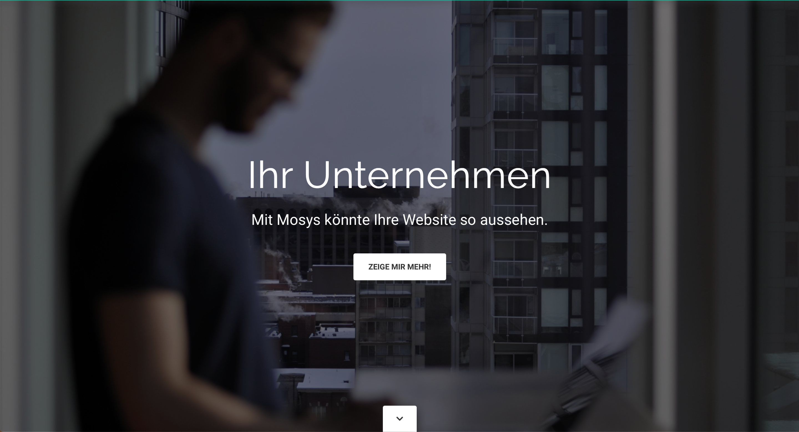
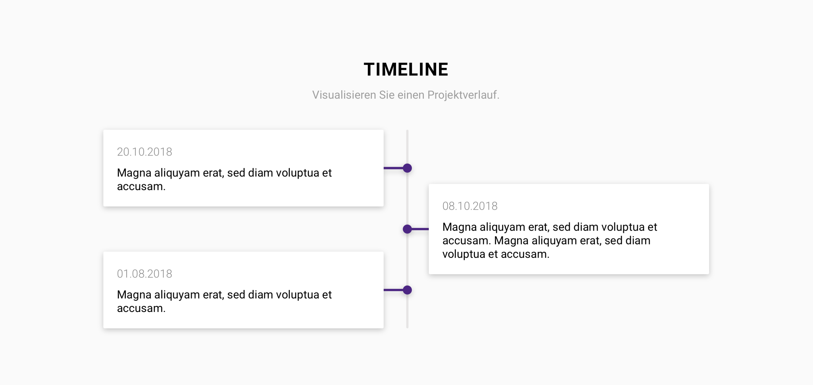

Small and medium-sized enterprises are an important sector of the Swiss economical landscape and in an effort at modernisation, many of these companies are looking to fortify their web presence. Oftentimes, a simple landing page was already enough. However, creating such a website required some level of effort, much of which was down to repetitive tasks like setting up the CMS and basic page types. Reducing the time spent on these basic tasks meant that we'd be able to offer websites at a more affordable price point, as well as enabling us to handle projects more efficiently and quickly.

Under the hood, Mosys is a collection of pre-configured content elements with sensible defaults. The elements, or sections, can be configured as needed and offer a lot of flexibility. It was quite remarkable how different all sites looked, despite being built on the same foundation.

<figure>
  
  <figcaption data-marginalia="right">A promotional site setting the general mood for working with a Mosys website.</figcaption>
</figure>

Upwards of 20 Mosys installations are currently running, most of which are maintained by the customers. They are kept up-to-date based on a service level agreement.

# Things I've learned

Mosys was more or less my first experience in dealing with the [Neos CMS](https://neos.io). The learning curve was quite steep at first since all architectural levels rely on conventions or even entirely new languages, like the view model based on Fusion (formerly TypoScript). Getting to learn these concepts on such a project was not easy considering the importance of keeping everything abstract enough to work for a multitude of clients.

Once the familiarity with Neos, Fusion, and Fluid kept growing, developing new functionality became more and more effortless. Towards the end of 2017 I was put in charge of the development, creating most new features and handling the development strategy by myself. This gave my a level of flexibility and insight into the planning side that was very much different to how other projects were handled. Dealing with this responsibility was an interesting learning experience.

<figure>
  
  <figcaption data-marginalia="right">Just one of Mosys' sections, a timeline. This section went through several iterations before we'd settled on the alternating layout.</figcaption>
</figure>

Over the course of the project I was even able to get some insight into the product marketing. Seeing how features I had developed were then promoted to customers lead to a deeper understanding of how I could develop new components with the customer in mind.

# Technologies I've used

Mosys is built on Neos CMS. Neos allows users to edit their pages inside a WYSIWYG editor that is focused on content first and foremost. This means that very often, users quickly felt comfortable editing their websites all by themselves, which in turn reduced our ongoing costs.

Other than the CMS aspect, Mosys is mostly just configuration and templating. Some scripting is involved, like a custom slider and carousel implementation, along with some server-side logic to handle more complex tasks.

One of the more interesting technological facets was the reliance on Composer for deployment. The project was split into mutliple packages in order to achieve a proper separation of concerns. These packages then had dependencies among each other that were handled manually for the most part. This process was rather tedious so I'd decided to set up an auto-updating private composer repository using [Satis](https://getcomposer.org/doc/articles/handling-private-packages-with-satis.md#satis). We then sarted using this repository throughout all projects, thus leading to a more unified deployment process based on Composer.
