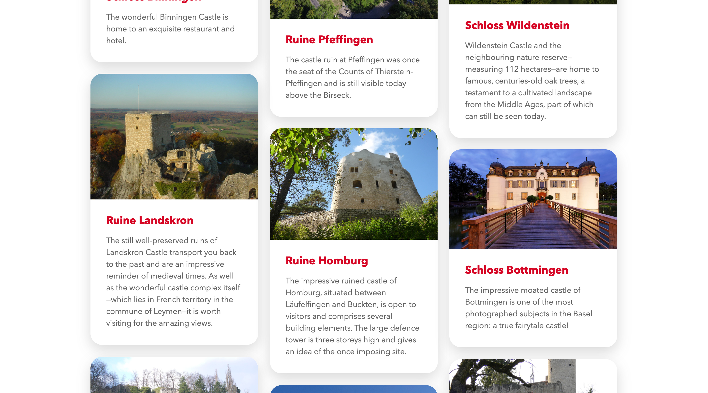

The Top 10 app showcases the ten best sights and experiences accross a variety of categories. Each entry is displayed with vibrant imagery, a short description and all the required information. All of this was to be made available through a website, as well as through apps on iOS and Android.

While designing the UI, I quickly realised that images needed to be the focus of the experience. This made browsing the list of entries more enjoyable and allows users to quickly get an overview of each category. On the detail pages, users could then get a deeper preview of the experience through hero images and galleries.

# Things I've learned

I designed both the website and the application UI. Figuring out some of the intricacies and how to adapt the UI to these circumstances was an interesting task, especially when it came to the differences between iOS and Android, and deciding how to make the app feel right on both platforms.

<figure>
  
  <figcaption data-marginalia="right">The site was laid out using cards showing just the most essential information.</figcaption>
</figure>

Regarding the app, I was only making smaller enhancements and fixes. Nonetheless, this was an interesting insight into an Ionic app and its deployment.

# Technologies I've used

The site was built using the Neos CMS. Since I'd gathered some experience with the technology in other projects, getting the site up and running was fairly easy. Data about categories and entries was to be made available from the website through a REST API, which took some time to figure out, but worked seamlessly in the end.

Working with Angular inside the Ionic app was challenging as I was so used to React. What was most impressive for me was seeing how TypeScript could be of value and how I could implement it in other projects as well.
